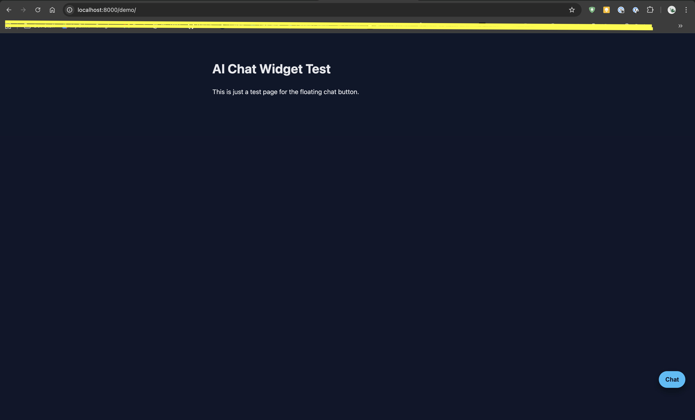

# Kit AI Chat Widget

A small, reusable floating chat widget built for my portfolio site.

This repo contains the **front-end widget** and a simple demo page.

- In this repo, the widget runs in “demo mode” with canned replies.
- On my live CV site , the same widget communicates with a real AI backend via a Netlify Function.

---

## Screenshot



---

## Features

- Floating chat button fixed to the bottom-right corner
- Slide-up chat panel with message history
- Typing indicator for responses
- Clean, isolated CSS so it won’t interfere with a host site
- Pure front-end demo (safe to clone and inspect)
- Separate backend integration on the `kbb-cv` repo

---

## Project structure

```text
kit-ai-widget/
  demo/
    index.html        # Demo page — open this via /demo/ in the browser
  widget/
    styles.css        # Styles for button, panel, messages
    widget.js         # Widget behaviour and demo replies
  README.md
  .gitignore
  node_modules/       # Only needed if using tooling; not needed to view demo

---

## Running the demo locally

From the project root:

python3 -m http.server 8000


Then open:

http://localhost:8000/demo/

---

## Embedding the widget into another site

To use this widget on another website (e.g. your portfolio):

1. Copy the widget/ folder

Place it in the root of your site:

your-site/
  index.html
  widget/
    styles.css
    widget.js
2. Add the stylesheet

Inside your site’s <head>:

<link rel="stylesheet" href="/widget/styles.css">

3. Paste the widget HTML

Add this just before your </body>:

<!-- Chat button -->
<button
    id="chat-toggle"
    class="chat-toggle"
    type="button"
    aria-label="Open chat"
>
    Chat
</button>

<!-- Chat panel -->
<div id="chat-panel" class="chat-panel hidden" aria-hidden="true">
    <header class="chat-panel__header">
        <h2 class="chat-panel__title">AI Assistant</h2>
        <button
            id="chat-close"
            class="chat-panel__close"
            type="button"
            aria-label="Close chat"
        >
            ×
        </button>
    </header>

    <div class="chat-panel__messages" id="chat-messages"></div>

    <form class="chat-panel__input-row" id="chat-form">
        <input
            type="text"
            id="chat-input"
            class="chat-panel__input"
            placeholder="Type a message..."
            autocomplete="off"
        >
        <button type="submit" class="chat-panel__send">Send</button>
    </form>
</div>

4. Load the JavaScript

Also before </body>:

<script src="/widget/widget.js"></script>

5. (Optional) Connect to a real backend

In this repo, the widget uses a simple demo function:

async function fetchAIResponse(userText) {
    await new Promise(resolve => setTimeout(resolve, 500));
    return "Demo mode: this widget is front-end only.";
}


On a real site, replace it with a proper call:

async function fetchAIResponse(userText) {
    const response = await fetch("/.netlify/functions/chat", {
        method: "POST",
        headers: { "Content-Type": "application/json" },
        body: JSON.stringify({ message: userText })
    });

    const data = await response.json();
    return data.reply || "I could not generate a response.";
}
```
